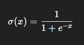
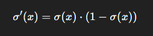

### 🔹 What is the Sigmoid Function? 

The Sigmoid function is a type of activation function used in neural networks. It maps any real-valued number to a value between 0 and 1, making it useful when you want to interpret the output as a probability.

### 🔹 Formula

<!--   -->

$$
\sigma(x) = \frac{1}{1 + e^{-x}}
$$

<!-- Sigmoid: σ(x) = 1 / (1 + e^(-x)) -->

Where:
- x is the input to the function
- e is Euler’s number (approx 2.718)

### 🔹 Graph

The Sigmoid function has an "S"-shaped curve. It smoothly transitions from 0 to 1 as the input \( x \) goes from negative to positive infinity.

- When \( x \to -\infty \), \( \sigma(x) \to 0 \)
- When \( x = 0 \), \( \sigma(x) = 0.5 \)
- When \( x \to +\infty \), \( \sigma(x) \to 1 \)

This shape helps squash large input values into a bounded range, which is useful for modeling probabilities.

The curve is centered at \( x = 0 \) and is symmetric around this point.

### 🔹 Example Outputs

| Input (x) | Output (σ(x)) |
|-----------|---------------|
| -3        | ≈ 0.047       |
| -1        | ≈ 0.269       |
|  0        | 0.5           |
|  1        | ≈ 0.731       |
|  3        | ≈ 0.953       |

### 🔹 Why use Sigmoid?

- Smooth curve 
- Output between 0 and 1 → good for binary classification 
- Differentiable → good for backpropagation 

### 🔹 Drawbacks
- Vanishing Gradient Problem: For very large or very small values of x, the gradient becomes close to zero. This slows learning.
- Not zero-centered: This can cause slow convergence in gradient-based optimization.

### 🔹 Derivative (Used in Backpropagation)
<!--  -->

$$
\sigma'(x) = \sigma(x) \cdot (1 - \sigma(x))
$$

### 🔹 When to Use
Use sigmoid mainly in the output layer for binary classification problems (like spam detection: spam or not).